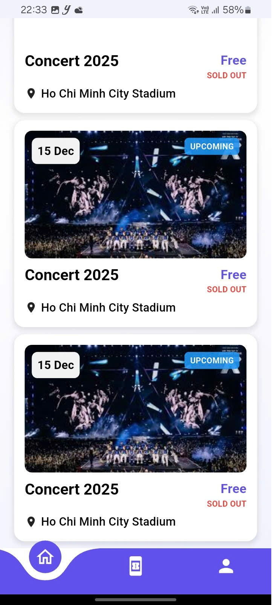

<div align="center">


<br/><br/>

# 🎟️ NFT Ticket Event

> **A mobile app for buying and managing event tickets as NFTs on the Blockchain**  
> Built with Flutter · Integrated with MetaMask · Ethereum Smart Contract

<br/>

</div>

---

## 📋 Project Description

**NFT Ticket Event** is a modern mobile application that allows users to **buy and manage event tickets as NFTs** (Non-Fungible Tokens) on the Ethereum Blockchain.

Each ticket is a unique NFT minted on the blockchain — ensuring **transparency, forgery-proof authenticity, and free transferability** on the secondary market.

### ✨ Key Features

| Feature | Description |
|---|---|
| 🎫 **Mint NFT Tickets** | Organizers create and issue tickets as ERC-721 NFTs |
| 🛒 **Buy Tickets** | Users purchase tickets directly in the app without needing a wallet |
| 🔍 **Ticket Verification** | Scan QR code to verify ticket authenticity on the blockchain |
| 📊 **Event Management** | Organizers track revenue and number of tickets sold |

---

## 🛠️ Tech Stack

### Mobile App
- **Flutter 3.35.6** — Cross-platform framework (Android / iOS)
- **Dart 3.9.2** — Programming language

### Blockchain
- **Ethereum** — Blockchain platform
- **Solidity** — Smart Contract language
- **ERC-721** — NFT standard
- **Remix IDE** — Smart Contract development & deployment
- **MetaMask** — Crypto wallet for blockchain connection

### Backend & Tools
- **Infura** — Ethereum node provider

---

## 🖼️ Demo

### 🎬 Video Demo

<div align="center">

[](https://drive.google.com/file/d/1EzbjA4f2JNY1lDWhZNoLAIKpUNUIrflv/view)

</div>

---

### 📸 Screenshots

| Home Screen | Event List | NFT Ticket Detail |
|:---:|:---:|:---:|
|  |  |  |

| Connect MetaMask | Buy Ticket | 
|:---:|:---:|:---:|
|  |  | 

---

## 🚀 Installation & Setup

### System Requirements

- [Flutter SDK](https://flutter.dev/docs/get-started/install) >= 3.0.0
- [Dart SDK](https://dart.dev/get-dart) >= 3.0.0
- [Node.js](https://nodejs.org/) >= 16.x
- [MetaMask Extension](https://metamask.io/) (browser) or MetaMask Mobile
- Android Studio (to run emulator)

---

### 📱 Part 1: Run Flutter App

#### Step 1 — Clone the repository

```bash
git clone https://github.com/vietthuan03/nft_ticket_event_ui.git
cd nft_ticket_event_ui
```

#### Step 2 — Install dependencies

```bash
flutter pub get
```

#### Step 3 — Configure environment

Create a `.env` file at the project root (or edit `lib/config/app_config.dart`):

```env
# Blockchain Network
RPC_URL=https://sepolia.infura.io/v3/YOUR_INFURA_PROJECT_ID
CHAIN_ID=11155111

# Smart Contract
CONTRACT_ADDRESS=0xYourDeployedContractAddress
```

#### Step 4 — Run the app

```bash
# Check connected devices / emulators
flutter devices

# Run on Android Emulator
flutter run

# Run on iOS Simulator
flutter run -d ios

# Build APK
flutter build apk --release

# Build IPA (macOS)
flutter build ipa
```

---

### 🦊 Part 2: MetaMask Setup (Blockchain)

#### Step 1 — Install MetaMask

1. Download the [MetaMask](https://metamask.io/download/) extension for Chrome
2. Create a new wallet and safely store your **Secret Recovery Phrase**
3. Log in to your MetaMask wallet

#### Step 2 — Add Test Network (Testnet)

Open MetaMask → **Settings → Networks → Add Network**:

```
Network Name:    Sepolia Test Network
RPC URL:         https://sepolia.infura.io/v3/YOUR_PROJECT_ID
Chain ID:        11155111
Symbol:          ETH
Block Explorer:  https://sepolia.etherscan.io
```

#### Step 3 — Get Test ETH (Faucet)

Visit [Sepolia Faucet](https://sepoliafaucet.com/) and enter your wallet address to receive free ETH for testing.

#### Step 4 — Deploy Smart Contract

```bash
# 1. Open Remix IDE
https://remix.ethereum.org

# 2. Compile Contract
Solidity Compiler -> Compile

# 3. Connect MetaMask
Deploy & Run Transactions
Environment -> Injected Provider - MetaMask

# 4. Select Sepolia network in MetaMask

# 5. Deploy Contract
Deploy -> Confirm transaction

# 6. Copy the contract address after successful deployment
```

After deploying, **copy the contract address** and update your `.env` file:
```env
CONTRACT_ADDRESS=0xAbCdEf...your_contract_address
```

---

## 📦 Libraries Used

### Flutter / Dart Packages

| Package | Version | Purpose |
|---|---|---|
| [`provider`](https://pub.dev/packages/provider) | ^6.1.5+1 | State management (Provider) |
| [`dio`](https://pub.dev/packages/dio) | ^5.9.0 | Advanced HTTP client |
| [`qr_flutter`](https://pub.dev/packages/qr_flutter) | ^4.1.0 | Generate QR codes for tickets |
| [`mobile_scanner`](https://pub.dev/packages/mobile_scanner) | ^7.1.3 | Scan QR codes for ticket verification |
| [`flutter_svg`](https://pub.dev/packages/flutter_svg) | ^2.2.1 | Display SVG icons |
| [`shared_preferences`](https://pub.dev/packages/shared_preferences) | ^2.5.4 | Local data storage |
| [`intl`](https://pub.dev/packages/intl) | ^0.20.2 | Number and date formatting |
| [`shimmer`](https://pub.dev/packages/shimmer) | ^3.0.0 | Loading skeleton effect |

---

## 🌐 Smart Contract

The `NFTTicket.sol` contract implements the **ERC-721** standard with the following functions:

```solidity
// Mint an NFT ticket for an event
function mintTicket(address to, uint256 eventId, string memory tokenURI) external

// Purchase a ticket
function buyTicket(uint256 tokenId) external payable

// Verify a ticket
function verifyTicket(uint256 tokenId) external view returns (bool)
```

---

## 📄 License

Distributed under the MIT License. See `LICENSE` for more information.

---

<div align="center">

Made with ❤️ by [vietthuan03](https://github.com/vietthuan03)

⭐ **Star this repo if you find it useful!** ⭐

</div>
